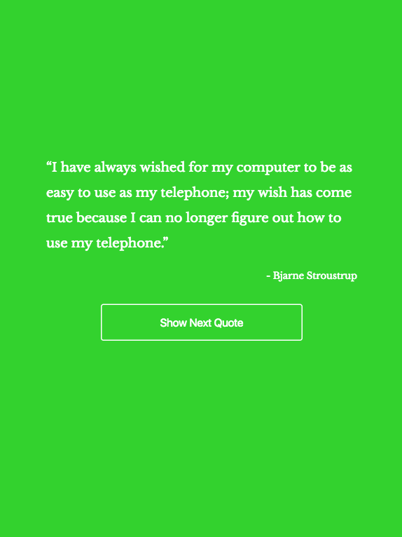

# Random Quote Generator

## Introduction

In this project, I created a page that will randomly generate quotes from a data object. This page will change its displayed quote when we click the button / pres any key / 30 seconds has passed. This page also will not displayed the same quote until all of quotes has been displayed.

### Demo pages

You can see the demo page [here](https://wahidyankf.github.io/random-quote-generator/).

### Result

The result can be seen in the gh-pages branch of this repository.

### The Source

The source of this app can be seen in the src folder of master branch. 

## Testing

This app was tested using [HTML](https://validator.w3.org/) and [CSS](https://jigsaw.w3.org/css-validator/) validator.

## Sreenshots

## License

[MIT](https://en.wikipedia.org/wiki/MIT_License).